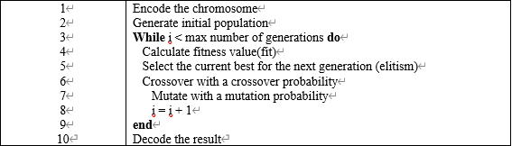

## JOINT OPTIMIZATION OF ELECTRIC VEHICLE DELIVERY AND CHARGING

### Algorithms

中文：

- 采用载重约束作为判断条件，来提高初始化的种群的优秀程度。
- 针对变异概率和交叉概率对于优良染色体的破坏问题，设计一个保留比例来确保优良染色体的存活。
  - 对于交叉操作，只会用优良染色体来作为交叉操作前的父代染色体，因此得到的子代染色体都部分保存了优良染色体的优秀基因片段，且得到这些子代染色体只会替换原本种群中非优良染色体的其中一部分，不会威胁到优秀的父代染色体的存活。
  - 对于变异操作，只会对非优良染色体进行变异操作

English:

- The current load capacity of the electric vehicle is used as a constraint to improve the goodness of the initialized chromosomes.
- For the problem of mutation operation and crossover operation on the destruction of excellent chromosomes, a retention ratio is designed to ensure the survival of perfect chromosomes.
  - Only the excellent chromosomes are used as the parent chromosomes before the crossover operation for the crossover operation. Therefore, the obtained progeny chromosomes partially preserve the outstanding gene segments of the excellent chromosomes, and these progeny chromosomes will only replace the non-excellent ones in the original population. A part of the chromosome that does not threaten the survival of the excellent parent chromosome.
  - For mutation operations, only the poor chromosomes are mutated.

### Experiment

|                          | 1000              | 2000               | 3000              | 4000              | 5000               |
| :----------------------: | ----------------- | ------------------ | ----------------- | ----------------- | ------------------ |
| Original Algorithm Cost  | 6694.461250565502 | 6567.5387209267155 | 6358.757142043408 | 6349.83320131002  | 6452.5479141953965 |
| Improved Algorithm Cost  | 6329.263933981575 | 5640.5627148137455 | 5484.445505038274 | 5428.881286328544 | 5376.666831521301  |
| Performance Optimization | 5.45%             | 14.11%             | 13.74%            | 14.50%            | 16.67%             |

中文：

- 相比起Original Genetic Algorithm的结果， Improved Genetic Algorithm的结果普遍拥有更好的规划结果，即总费用更低。
- Original Genetic Algorithm随着迭代次数的增加，得到的结果会**存在波动**； Improved Genetic Algorithm随着迭代次数的增加，得到的结果几乎不会出现回弹，**保持稳定下降或者维持原状**。
- 在迭代次数达到**5000**次时，采用 Improved Genetic Algorithm将比采用Original  Genetic Algorithm节省**16.67%**的总费用。

English:

- Results from the Improved Genetic Algorithm generally have better planning outcomes, which means lower overall costs than those from the Original  Genetic Algorithm.
- As the number of iterations increases, the results obtained by the Original  Genetic Algorithm **may fluctuate**; however, the results obtained by the Improved Genetic Algorithm will hardly rebound, **keep a steady decline or remain the same**.
- When the number of iterations reaches **5000**, using the Improved Genetic Algorithm will save **16.67%** of the total cost compared to using the Original  Genetic Algorithm.
