## JOINT OPTIMIZATION OF ELECTRIC VEHICLE DELIVERY AND CHARGING

> ***<u>Selected sections from my paper (listed in this repository)</u>***

### Abstract

Nowadays, electric vehicles have gradually become the mainstream distribution tool in the logistics industry due to their low fuel costs, a small amount of greenhouse gas emissions, and many other advantages. Aiming at this social phenomenon, this paper conducted a literature survey and introduces the electric vehicle routing planning problem with time window and charging station(E-VRPTW) and analyzes it, hoping to solve this engineering problem. For examples of this problem, given the respective customer site, the geographic information data distribution center and charging station, and gives a load limit, the customer service time window, the upper limit of the electric vehicle battery electric vehicle. These constraints make the calculation example in this paper closer to the logistics and distribution situation in real life. Goal of this paper is to design an algorithm that can cost under the premise of meeting all kinds of constraints, to minimize the problem of vehicle route planning.

In terms of model construction, this paper establishes a mathematical model of mixed integer programming. In terms of the solution method, this paper proposes an improved genetic algorithm design, which is improved and optimized for some of the defects of the traditional genetic algorithm, making the genetic algorithm in this paper more suitable for solving electric vehicle routing planning problem with time window and charging station**(E-VRPTW).** In addition, this article gives the design idea of the experimental example and uses this example to carry out the experiment. The experimental results prove that the genetic algorithm designed in this paper has an excellent performance in the stability of running time, the convergence of the objective function, the reasonableness of the path planning results, and the degree of time window coincidence when dealing with this problem. The model construction ideas and genetic algorithm improvement ideas proposed in this paper can be used as a reference for saving the cost of electric vehicle logistics, promoting the development of electric vehicle logistics, and realizing the configuration and energy management of energy and power equipment.

### Model

- Transportation Cost
  - 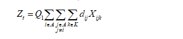
- Charge Cost
  - 
- Time Penalty
  - 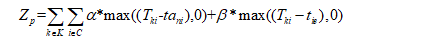
- Overload Penalty
  - 
- Battery Drain Penalty
  - 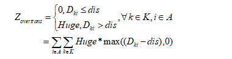
- Sum Cost:
  - 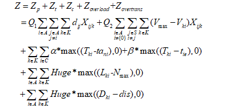
- Constraints
  - 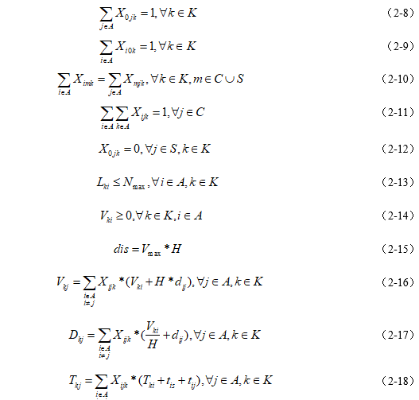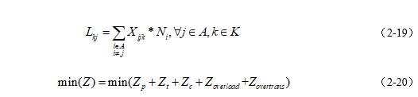
  - Constraints 2-8 indicate that all electric vehicles depart from the distribution center;
    Constraints 2-9 indicate that all electric vehicles eventually return to the distribution center;
    Constraints 2-10 indicate that the flow of electric vehicles is conserved, and vehicle k enters any point m except the freight center, and then leaves from m.
    Constraint 2-11 means that any client j will only be served once;
    Constraint 2-12 means that electric vehicles cannot use the charging station as the first destination to leave the freight center;
    Constraints 2-13 indicate that the load capacity of an electric vehicle at any node cannot exceed the upper load limit;
    Constraints 2-14 indicate that the remaining power of the electric vehicle at any node is greater than 0;
    Equation 2-15 represents the relationship between the upper limit of the mileage of the electric vehicle and the upper limit of the maximum power of the electric vehicle;
    Equation 2-16 represents the current amount of electric vehicle k arriving at node i;
    Equation 2-17 represents the current mileage of electric vehicle k to node i;
    Equation 2-18 represents the current time when electric vehicle k arrives at node i;
    Equation 2-19 represents the current load of electric vehicle k to node i;
    Equation 2-20 represents the objective function, which is to minimize the total cost of the entire logistics process;

### Algorithms

The fitness function is the inverse of the total cost :

### Experiment Setting

Some papers will use Solomon's VRPTW data set as a reference data set, but according to observations, this paper proposes certain problems in this approach, and a data set that conforms to its own research problems should be constructed. The reasons are as follows:

- First, most papers only use the top 25 or top 30 data points of the 100 data points in Solomon's VRPTW dataset, a partial choice that makes their experimental results unable to use the criteria attached to Solomon's dataset solution to verify the validity of the algorithm.

- Second, the vehicle model used in most papers is not the same as Solomon's, and there is a big difference in the time window of customer points, so most papers use parameters such as time window and freight volume constructed by themselves. Such modifications make it less meaningful to call the Solomon dataset and only use part of the data point information. Solomon's different datasets obey different distributions, and such data points can be generated entirely autonomously.

- Third, the Solomon dataset does not consider charging stations, so neither the accompanying standard solution nor the related data points are suitable as a reference dataset for electric vehicle path planning problems.

Based on the above thinking, this paper randomly chooses to generate each data point through multiple simulation experiments. And according to the average delivery mileage and time-consuming of each electric vehicle for different data points, a customer time window that conforms to the scale of this paper is constructed, and the data set for this experiment is given.

Suppose there is a distribution center in a certain region, and it needs to deliver goods to 25 customers in the same region. Each individual has specific coordinates, and each customer has an independent service time, freight volume and expected time window. The serial number 0 represents the distribution center, the serial number 1~25 represents the customer, and the serial number 26 and 27 represent the charging station.

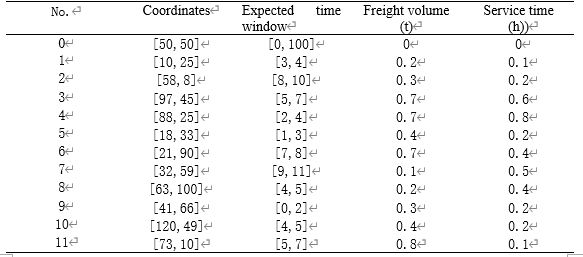

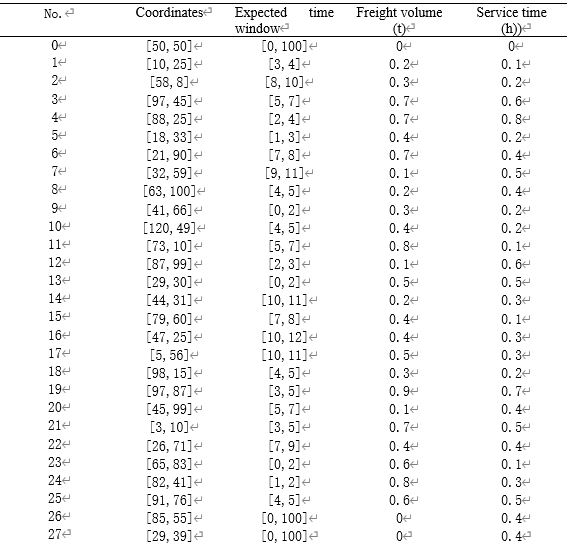

The specific information of each node is shown in Table 4-1. Among them, the expected time windows of the charging station and the freight center are both [0, 100]. The purpose of this is to ensure that regardless of the planning results, the loose time windows of these two types of nodes can accommodate various situations and are more realistic.

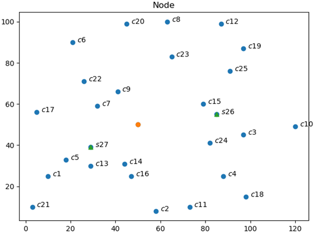

### Result

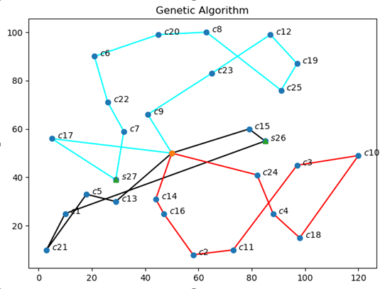

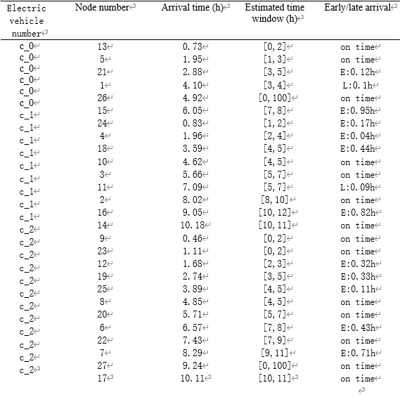

We can see that the vast majority of customer points are served on time or within 0.5 hours of the expected time window. This paper believes that such planning results are relatively good, because in addition to the time window, the vehicle mileage, the upper limit of the load, and the upper limit of electricity are all points that logistics companies should consider. The degree of agreement of such time windows in the experimental results is acceptable in real life. In addition, in the calculation example design of this paper, the length of the time window of most customer points is 1 hour or 2 hours, and the length of the path travel time of every two nodes is about 1 hour, so the size of such a time window is actually is more strict.

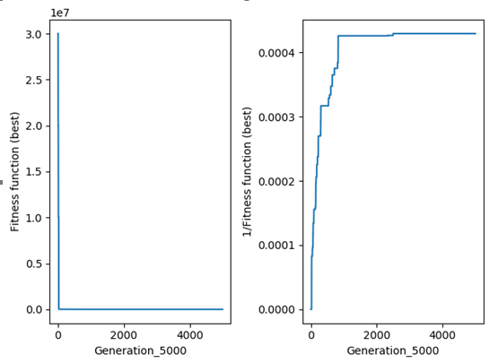

When the number of iterations is about 750, the fitness function value of the genetic function basically reaches a stable stage. As the number of iterations increases, the growth of the fitness function becomes smaller or even almost constant. The genetic algorithm designed in this paper has excellent performance in many aspects, such as the stability of running time, the convergence of objective function, the rationality of path planning results, and the degree of coincidence of time windows.